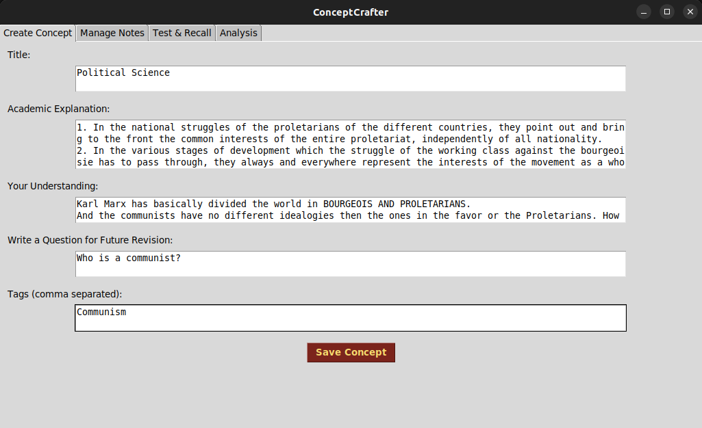
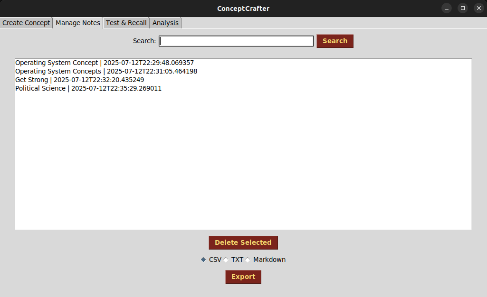
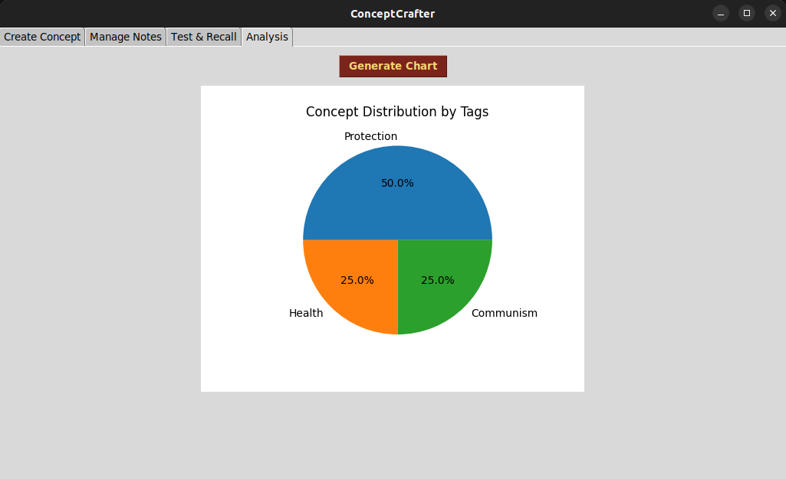
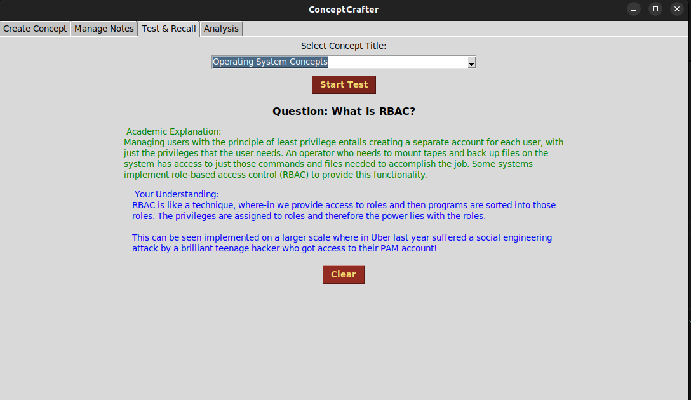

# 🧠✨ ConceptCrafter

Welcome to **ConceptCrafter** — your personal knowledge vault designed to **capture, revise, and reinforce** key concepts with clarity and efficiency. Whether you're learning Machine Learning, Cybersecurity, Networking, or Philosophy — ConceptCrafter becomes your spellbook of understanding.

---

## 🪄 What is ConceptCrafter?

**ConceptCrafter** is a cross-platform desktop app (Linux, Windows, macOS) built with Python + Tkinter that allows users to:

- Document important concepts using **academic definitions** and **personal understanding**
- Create **self-generated questions** for future recall
- Use **test mode** to revise concepts like flashcards
- Analyze your learning patterns with **visual charts**
- Export concepts in **CSV**, **TXT**, or **Markdown** format
- Feel like a Gryffindor genius while doing it 🦁📚

---

## 🎯 Key Features

### 📝 Create Concept

- Add a new concept with:
  - **Title**
  - **Academic Explanation**
  - **Your Own Understanding**
  - **Custom Question** for self-testing
  - **Tags** for easy categorization

### 📂 Manage Notes

- View all your concepts
- Search by **title, tags, explanation, understanding**
- Delete selected concepts
- Export results to:
  - `CSV`
  - `TXT`
  - `Markdown`

### 🎮 Test & Recall Mode

- Select concept by **title**
- Answer your **own predefined question**
- Reveal **academic explanation + self-understanding**
- Mark ✅ Correct or ❌ Incorrect
- Auto-track your recall
- Clear fields with one click

### 📊 Analysis

- Click **"Generate Chart"** to visualize your concept categories
- Charts are refreshed automatically on each click
- Styled in **Gryffindor color palette** for maximum motivation

---

## 🔧 How to Use

1. Clone the repo  
   `git clone https://github.com/yourusername/ConceptCrafter.git`

2. Install dependencies  
   `pip install -r requirements.txt`

3. Run the app  
   `python main.py`

---

## 🚀 Features Planned for Future

- Add reminders for spaced repetition
- Auto-save + cloud sync
- Dark mode toggle
- Minimal AI-integration for offline NLP keyword tagging

---

## 🪐 Why Use ConceptCrafter Over Traditional Tools?

| Feature                  | Notes App | Anki | ConceptCrafter |
|--------------------------|-----------|------|----------------|
| Custom Explanations      | ❌         | ✅    | ✅              |
| Self-written Questions   | ❌         | ✅    | ✅              |
| Visual Analysis Charts   | ❌         | ❌    | ✅              |
| Rich Text + Tag Search   | ❌         | ❌    | ✅              |
| Harry Potter Vibes ⚡     | ❌         | ❌    | ✅🦁            |

---

## 📦 Cross Platform Build (Coming Soon)

| OS        | File Format | Support |
|-----------|-------------|---------|
| Windows   | `.exe`      | ✅      |
| macOS     | `.dmg`      | ✅      |
| Linux     | `.AppImage` | ✅      |

_Thanks to GitHub Actions for automated packaging!_

---

##  Screenshots

> 

> 

> 

> 

